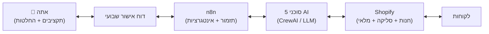

# חנות דרופשיפינג מבוססת סוכני AI — תוכנית עבודה מלאה

> 📁 פרויקט זה נוסף כתיקייה עצמאית בריפו הזה, בנפרד מ"רהיט בבית" (`index.html` בשורש) — שני מוצרים שונים לגמרי שחולקים ריפו אחד. שום קובץ קיים לא שונה.

תוכנית מלאה להקמת חנות דרופשיפינג בגישת **Maximum Automation**: רשת של סוכני AI מנהלת מחקר, תוכן, שיווק, שירות לקוחות ו-SEO, ואתה מתמקד באישור תקציבים והחלטות עסקיות בלבד.

## סקירה כללית — איך זה מתחבר

**שתי שכבות:** n8n מתזמן ומחבר מערכות (Shopify, מיילים, פרסום, אנליטיקס); סוכני ה-AI (CrewAI) מספקים את שיקול הדעת (איזה מוצר, אילו טקסטים, אילו החלטות). ראו נימוק מלא במסמך הארכיטקטורה.

## מסמכי התוכנית

1. **[ארכיטקטורת סוכני ה-AI](./docs/01-agents-architecture.md)** — 5 הסוכנים, תפקיד כל אחד, כלים מומלצים, שערי אישור
2. **[תוכנית האתר](./docs/02-website-plan.md)** — למה Shopify ולא קוד מותאם אישית, מבנה עמודים, מערכת עיצוב
3. **[אסטרטגיית שיווק](./docs/03-marketing-strategy.md)** — תוכן אורגני, פרסום ממומן, פרומפטים ל-AI, 3 דוגמאות מודעה
4. **[מפת דרכים ליישום](./docs/04-roadmap.md)** — שלב-אחר-שלב, כולל בדיוק איפה נדרשת ההתערבות שלך

## קוד שסופק בפועל (הצעד הראשון בפועל)

- **[`agents/`](./agents)** — שלד קוד CrewAI (Python) שמממש את 5 הסוכנים כ-Agents/Tasks אמיתיים, מוכן להרצה ברגע שמזינים מפתחות API
- **[`site-template/`](./site-template)** — תבנית עיצוב לדף מוצר: HTML/CSS/JS עצמאי, נקי, RTL, Mobile-first (ראו הסבר על תפקידו במסמך תוכנית האתר — הוא רפרנס עיצובי, לא מערכת סליקה)

## מאיפה מתחילים

ראו את הסעיף האחרון במסמך [מפת הדרכים](./docs/04-roadmap.md#הצעד-המעשי-הראשון-החל-מעכשיו) — בקצרה: לאשר את חלוקת התפקידים, למלא את "הגדרות הסיכון" הפיננסיות, ולפתוח 2-3 חשבונות בסיסיים (Shopify, n8n, מפתח API) כדי שהקוד ב-`agents/` יוכל לרוץ בפעם הראשונה.
