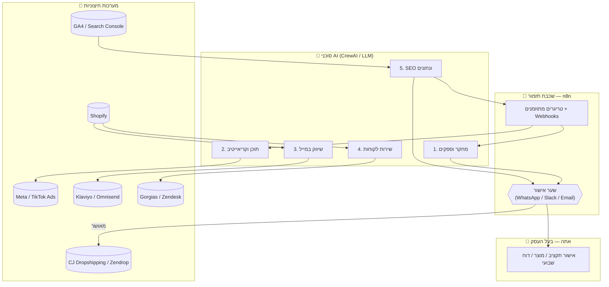

# ארכיטקטורת סוכני ה-AI

## עקרון-על

התפקיד שלך מצטמצם לשני דברים בלבד: **אישור תקציבים** ו**קבלת החלטות שרק בעל עסק יכול לקבל** (מותג, נישה סופית, סיכון משפטי/פיננסי). כל השאר — מחקר, תוכן, שיווק, שירות לקוחות, אופטימיזציה — רץ אוטומטית דרך רשת סוכנים, עם "שערי אישור" (Approval Gates) מוגדרים מראש שמעבירים אליך רק החלטות שעולות כסף אמיתי.

זה מושג לא דרך "5 סוכני AI עצמאיים שמדברים אחד עם השני" (זה נשמע מרשים אבל בפועל שביר, יקר להרצה ברצף, וקשה לניטור) — אלא דרך **שתי שכבות שונות שמשלימות זו את זו**:

| שכבה | תפקיד | כלי מומלץ |
|---|---|---|
| **תזמור ואינטגרציה** (ה"גוף העצבים") | טריגרים, תזמון, חיבור בין מערכות (Shopify, מייל, פרסום, אנליטיקס), לוגים, retry על כשלים | **n8n** |
| **חשיבה ותוכן** (ה"מוח") | כל מקום שדורש שיקול דעת, ניתוח, יצירת טקסט/אסטרטגיה | **CrewAI** (מריץ Claude/GPT) שמופעל מתוך n8n דרך HTTP/Webhook |

**למה לא CrewAI לבד?** קשה לתזמן ("תרוץ כל בוקר ב-6"), קשה לחבר ל-30 API שונים בלי לכתוב קוד אינטגרציה לכל אחד, וקשה לצוות (אתה) לראות מה קורה בלי לפתוח לוגים של Python.

**למה לא n8n לבד?** אפשר בהחלט — לכל צעד אפשר לשים "OpenAI/Claude node" בתוך n8n בלי CrewAI בכלל, וזו התחלה סבירה יותר (ראה "צעד ראשון" למטה). אבל ברגע שסוכן צריך "לחשוב בכמה שלבים" עם כלים (למשל: לחפש מוצר → להשוות 3 ספקים → לנמק החלטה), CrewAI נותן מבנה מוכן (Agent/Task/Tool) שקל יותר לתחזק מאשר שרשרת ארוכה של nodes.

**המלצה מעשית:** להתחיל הכול בתוך n8n עם node של Claude, ולשדרג ל-CrewAI רק את הסוכנים שבאמת דורשים חשיבה רב-שלבית (בעיקר סוכן המחקר). זה גם ה"צעד הראשון" שמפורט בהמשך התוכנית.

---

## הסוכנים

### 1. סוכן מחקר וספקים (Research & Suppliers)

**מטרה:** למצוא מוצר עם פוטנציאל ויראלי/מכירתי, ולוודא שיש ספק אמין שאפשר לעבוד איתו אוטומטית.

| | |
|---|---|
| **קלט** | קריטריונים קבועים מראש: טווח מחיר עלות, שולי רווח מינימליים (למשל ≥40%), זמן משלוח מקסימלי, נישה מועדפת |
| **מקורות מידע** | Google Trends, TikTok Creative Center (מגמות פרסום), Meta Ad Library (ריגול חוקי אחרי מודעות מתחרים — ציבורי ולגיטימי), בסטסלרים ב-CJ Dropshipping / Zendrop / Spocket / Syncee |
| **תהליך** | 1) איתור 10-20 מוצרים מועמדים → 2) לכל מועמד: השוואת 2-3 ספקים (מחיר, זמן משלוח, דירוג) → 3) ניקוד לפי רווחיות/תחרותיות/מגמה → 4) דירוג סופי |
| **פלט** | "דוח הזדמנות מוצר": שם מוצר, קישור ספק, עלות, מחיר מכירה מוצע, רווח גולמי, זמן משלוח, רמת תחרות, ציון מגמה |
| **שער אישור** 👤 | **איזה מוצר להשיק ותקציב הבדיקה הראשוני** — זו החלטה כספית ואסטרטגית |
| **הערת זהירות** | להעדיף תמיד API רשמי (ל-CJ Dropshipping, Zendrop, Spocket יש API רשמי לאוטומציה) על פני scraping של אתרים שאוסר את זה בתנאי השימוש — scraping עלול לגרום לחסימת חשבון |

### 2. סוכן תוכן וקריאייטיב (Content & Creative)

**מטרה:** להפוך כל מוצר שאושר לחבילת תוכן שלמה — תיאור, פוסטים, תסריטי וידאו.

| | |
|---|---|
| **קלט** | נתוני המוצר מסוכן 1, מדריך טון-דיבור/מותג, קהל יעד |
| **תהליך** | תיאור מוצר לפי מבנה AIDA/PAS + SEO → 8-10 כיתובים לרשתות עם hooks שונים → תסריטי UGC ל-TikTok/Reels (מבנה Hook → Problem → Demo → CTA) → פרומפטים ליצירת ויזואליה |
| **פלט** | חבילת תוכן פר מוצר: תיאור, כיתובים, תסריטים, פרומפטים לתמונה/וידאו |
| **שער אישור** 👤 | אין צורך באישור שוטף — רק אישור "קול המותג" הראשוני |
| **מגבלה טכנית חשובה** | ל-Midjourney **אין API רשמי** (רק בוט דיסקורד) — לכן שלב יצירת התמונה בפועל נשאר חצי-ידני (מעתיקים את הפרומפט שנוצר) אלא אם עוברים למחולל עם API רשמי (למשל Ideogram, Stability AI). ל-Runway יש API רשמי לוידאו, כך שאותו ניתן לחבר אוטומטית ב-n8n |

### 3. סוכן שיווק במייל (Email Marketing)

**מטרה:** לתפוס הכנסה "בחינם" מלקוחות שכבר בקשר עם החנות — עגלה נטושה, ברוכים הבאים, win-back.

| | |
|---|---|
| **קלט** | אירועי Shopify (webhook): עגלה נטושה, הזמנה, הרשמה לניוזלטר |
| **תהליך** | ה-**מנוע השליחה** (עיתוי, טריגרים, A/B) הוא Klaviyo/Omnisend — כלים סטנדרטיים בתעשיית הדרופשיפינג עם אינטגרציה מובנית ל-Shopify. **הסוכן** הוא ה-LLM שכותב/מרענן את תוכן המיילים והנושאים | 
| **פלט** | טקסטים לרצפים (Welcome, Abandoned Cart, Post-Purchase, Win-back), הצעות A/B לכותרות |
| **שער אישור** 👤 | תקרת הנחה מקסימלית שהסוכן מותר להציע אוטומטית (למשל לא יותר מ-15%) |

### 4. סוכן שירות לקוחות (Customer Service)

**מטרה:** לענות מיידית ואנושית לרוב הפניות, ולהעביר לאדם רק את מה שבאמת דורש שיקול דעת.

| | |
|---|---|
| **קלט** | הודעת לקוח (מייל/צ'אט), היסטוריית הזמנות מ-Shopify, מאגר שאלות נפוצות |
| **תהליך** | סיווג כוונה → שליפת הקשר (סטטוס הזמנה) → ניסוח תשובה → **מקרים סטנדרטיים נשלחים אוטומטית**, **מקרי קצה מועברים לתור אנושי** |
| **פלט** | תשובה שנשלחה, או קריאת שירות (ticket) מועברת אליך |
| **שער אישור** 👤 | החזר כספי/פיצוי מעל סכום סף שתגדיר; הודעות "אדומות" (איום, תוכן משפטי, לקוח כועס מאוד) |
| **כלי מומלץ** | Gorgias (בנוי במיוחד לדרופשיפינג/Shopify, עם AI מובנה) — עדיף על בנייה ידנית של בוט צ'אט |

### 5. סוכן SEO וניתוח נתונים (SEO & Analytics)

**מטרה:** לשפר נראות אורגנית לאורך זמן, ולהיות "החושב האסטרטגי" שמזין את דוח האישור השבועי שלך.

| | |
|---|---|
| **קלט** | Google Search Console, GA4, נתוני מכירות Shopify, נתוני קמפיינים (Meta/TikTok Ads) |
| **תהליך** | ניתוח פערי מילות מפתח → הצעות למטא-תיאורים/כותרות → רעיונות לתוכן בלוג → **דוח KPI שבועי** (הכנסה, הוצאת פרסום, ROAS, CAC, המוצרים/מודעות הכי טובות/גרועות) |
| **פלט** | שינויי SEO קטנים מבוצעים אוטומטית (מטא-תגיות דרך Shopify API), שינויים גדולים יותר + **דוח שבועי עם 2-3 המלצות לפעולה** |
| **שער אישור** 👤 | זהו הדוח המרכזי שממנו אתה מאשר: הגדלת/הקטנת תקציב פרסום, השקת מוצר חדש, עצירת מוצר כושל |

---

## שכבת האישור (ה"ממשק" שלך לעסק)

כדי שבאמת תתמקד רק באישורים, כל ההחלטות הכספיות מתנקזות ל**דוח דיגסט אחד** (שבועי + מיידי לאירועים חריגים), שנשלח אליך ב-WhatsApp/אימייל/Slack ומכיל שאלות בפורמט כן/לא:

> "מוצר X: ROAS ירד מ-3.1 ל-1.8 ב-3 הימים האחרונים. מומלץ להקטין תקציב מ-$50 ל-$15/יום. לאשר?"
> "נמצא מוצר חדש עם ציון מגמה 8.7/10. עלות בדיקה: $120 (מלאי + פרסום ראשוני). לאשר השקה?"

זו נקודת המפגש בין "מקסימום אוטומציה" לבין השליטה הפיננסית שלך — הסוכנים לא מוציאים כסף בלי אישור מפורש למקרה הספציפי, אבל גם לא מטרידים אותך בהחלטות תפעוליות יומיומיות.
